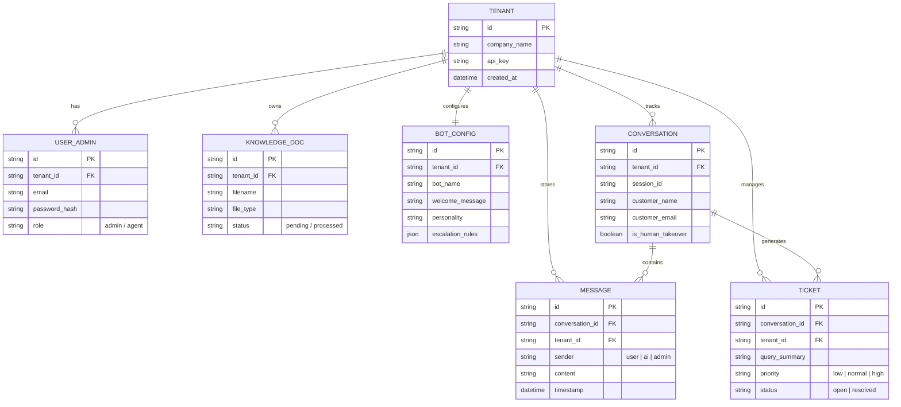

```mermaid
erDiagram
    TENANT ||--o{ USER_ADMIN : "has"
    TENANT ||--o{ KNOWLEDGE_DOC : "owns"
    TENANT ||--|| BOT_CONFIG : "configures"
    TENANT ||--o{ CONVERSATION : "tracks"
    TENANT ||--o{ MESSAGE : "stores"
    TENANT ||--o{ TICKET : "manages"

    TENANT {
        string id PK
        string company_name
        string api_key
        datetime created_at
    }

    USER_ADMIN {
        string id PK
        string tenant_id FK
        string email
        string password_hash
        string role "admin / agent"
    }

    BOT_CONFIG {
        string id PK
        string tenant_id FK
        string bot_name
        string welcome_message
        string personality
        json escalation_rules
    }

    KNOWLEDGE_DOC {
        string id PK
        string tenant_id FK
        string filename
        string file_type
        string status "pending / processed"
    }

    CONVERSATION {
        string id PK
        string tenant_id FK
        string session_id
        string customer_name
        string customer_email
        boolean is_human_takeover
    }

    MESSAGE {
        string id PK
        string conversation_id FK
        string tenant_id FK
        string sender "user | ai | admin"
        string content
        datetime timestamp
    }

    TICKET {
        string id PK
        string conversation_id FK
        string tenant_id FK
        string query_summary
        string priority "low | normal | high"
        string status "open | resolved"
    }

    CONVERSATION ||--o{ MESSAGE : "contains"
    CONVERSATION ||--o{ TICKET : "generates"
```
