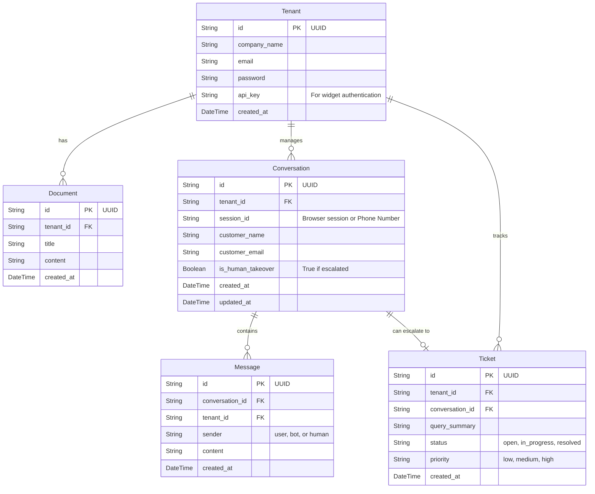

# Entity Relationship Diagram (ERD)

This diagram outlines the core data structures used in the PostgreSQL database, managed by Prisma. It supports our multi-tenant SaaS architecture.

```mermaid
erDiagram
    Tenant {
        String id PK "UUID"
        String company_name
        String email
        String password
        String api_key "For widget authentication"
        DateTime created_at
    }

    Document {
        String id PK "UUID"
        String tenant_id FK
        String title
        String content
        DateTime created_at
    }

    Conversation {
        String id PK "UUID"
        String tenant_id FK
        String session_id "Browser session or Phone Number"
        String customer_name
        String customer_email
        Boolean is_human_takeover "True if escalated"
        DateTime created_at
        DateTime updated_at
    }

    Message {
        String id PK "UUID"
        String conversation_id FK
        String tenant_id FK
        String sender "user, bot, or human"
        String content
        DateTime created_at
    }

    Ticket {
        String id PK "UUID"
        String tenant_id FK
        String conversation_id FK
        String query_summary
        String status "open, in_progress, resolved"
        String priority "low, medium, high"
        DateTime created_at
    }

    Tenant ||--o{ Document : "has"
    Tenant ||--o{ Conversation : "manages"
    Tenant ||--o{ Ticket : "tracks"
    Conversation ||--o{ Message : "contains"
    Conversation ||--o| Ticket : "can escalate to"
```
