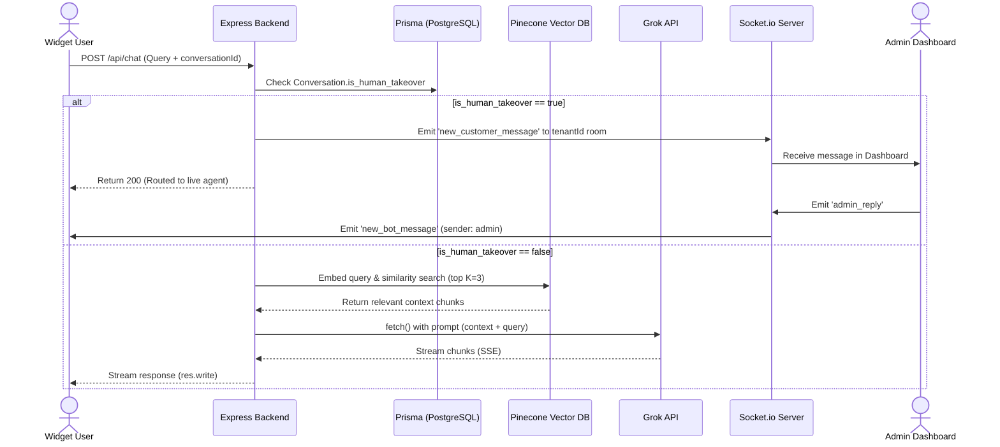

```mermaid
sequenceDiagram
    actor Customer as Widget User
    participant API as Express Backend
    participant DB as Prisma (PostgreSQL)
    participant Pinecone as Pinecone Vector DB
    participant Grok as Grok API
    participant Socket as Socket.io Server
    actor Admin as Admin Dashboard

    Customer->>API: POST /api/chat (Query + conversationId)
    API->>DB: Check Conversation.is_human_takeover
    
    alt is_human_takeover == true
        API->>Socket: Emit 'new_customer_message' to tenantId room
        Socket->>Admin: Receive message in Dashboard
        API-->>Customer: Return 200 (Routed to live agent)
        Admin->>Socket: Emit 'admin_reply'
        Socket->>Customer: Emit 'new_bot_message' (sender: admin)
    else is_human_takeover == false
        API->>Pinecone: Embed query & similarity search (top K=3)
        Pinecone-->>API: Return relevant context chunks
        API->>Grok: fetch() with prompt (context + query)
        Grok-->>API: Stream chunks (SSE)
        API-->>Customer: Stream response (res.write)
    end
```
