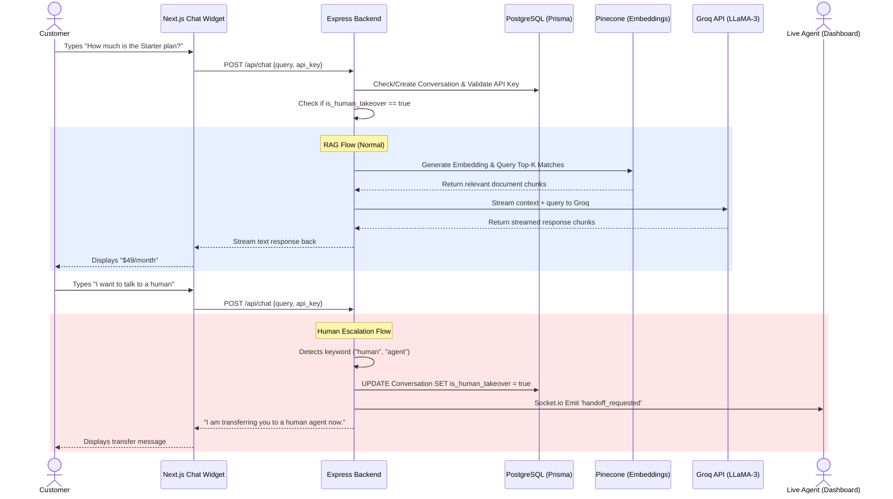

# System Sequence Diagram

This diagram illustrates the real-time chat flow, including Retrieval-Augmented Generation (RAG) and the Human Handoff mechanism.

```mermaid
sequenceDiagram
    actor Customer
    participant Widget as Next.js Chat Widget
    participant Server as Express Backend
    participant DB as PostgreSQL (Prisma)
    participant Vector as Pinecone (Embeddings)
    participant LLM as Groq API (LLaMA-3)
    actor Admin as Live Agent (Dashboard)

    Customer->>Widget: Types "How much is the Starter plan?"
    Widget->>Server: POST /api/chat {query, api_key}
    
    Server->>DB: Check/Create Conversation & Validate API Key
    
    Server->>Server: Check if is_human_takeover == true
    
    rect rgb(230, 240, 255)
        Note over Server: RAG Flow (Normal)
        Server->>Vector: Generate Embedding & Query Top-K Matches
        Vector-->>Server: Return relevant document chunks
        Server->>LLM: Stream context + query to Groq
        LLM-->>Server: Return streamed response chunks
        Server-->>Widget: Stream text response back
        Widget-->>Customer: Displays "$49/month"
    end

    Customer->>Widget: Types "I want to talk to a human"
    Widget->>Server: POST /api/chat {query, api_key}
    
    rect rgb(255, 230, 230)
        Note over Server: Human Escalation Flow
        Server->>Server: Detects keyword ("human", "agent")
        Server->>DB: UPDATE Conversation SET is_human_takeover = true
        Server->>Admin: Socket.io Emit 'handoff_requested'
        Server-->>Widget: "I am transferring you to a human agent now."
        Widget-->>Customer: Displays transfer message
    end
```
