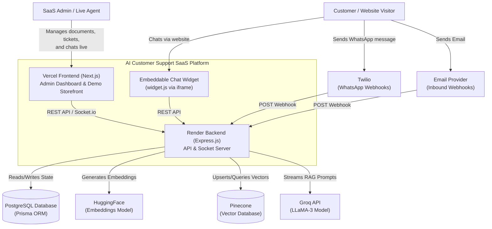

# System Context Architecture

This C4-model inspired diagram shows the high-level system architecture and how different external services integrate with our platform.

```mermaid
graph TD
    %% Actors
    Admin["SaaS Admin / Live Agent"]
    Visitor["Customer / Website Visitor"]
    
    %% Core System
    subgraph "AI Customer Support SaaS Platform"
        Frontend["Vercel Frontend (Next.js)<br/>Admin Dashboard & Demo Storefront"]
        Backend["Render Backend (Express.js)<br/>API & Socket Server"]
        Widget["Embeddable Chat Widget<br/>(widget.js via iframe)"]
    end
    
    %% Databases
    DB[("PostgreSQL Database<br/>(Prisma ORM)")]
    VectorDB[("Pinecone<br/>(Vector Database)")]
    
    %% External Integrations
    LLM["Groq API<br/>(LLaMA-3 Model)"]
    HF["HuggingFace<br/>(Embeddings Model)"]
    Twilio["Twilio<br/>(WhatsApp Webhooks)"]
    Email["Email Provider<br/>(Inbound Webhooks)"]

    %% Relationships
    Admin -- "Manages documents, tickets,<br/>and chats live" --> Frontend
    Visitor -- "Chats via website" --> Widget
    Visitor -- "Sends WhatsApp message" --> Twilio
    Visitor -- "Sends Email" --> Email
    
    Frontend -- "REST API / Socket.io" --> Backend
    Widget -- "REST API" --> Backend
    
    Twilio -- "POST Webhook" --> Backend
    Email -- "POST Webhook" --> Backend
    
    Backend -- "Reads/Writes State" --> DB
    Backend -- "Generates Embeddings" --> HF
    Backend -- "Upserts/Queries Vectors" --> VectorDB
    Backend -- "Streams RAG Prompts" --> LLM
```
