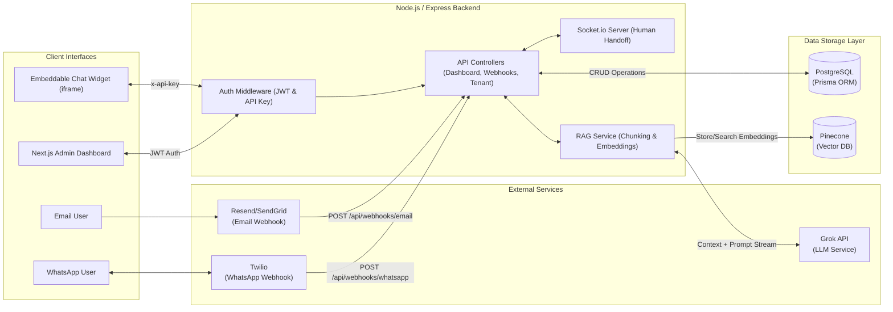

```mermaid
flowchart LR
    subgraph Clients["Client Interfaces"]
        A["Next.js Admin Dashboard"]
        B["Embeddable Chat Widget (iframe)"]
        WApp["WhatsApp User"]
        Email["Email User"]
    end

    subgraph BackendApp["Node.js / Express Backend"]
        C["Auth Middleware (JWT & API Key)"]
        D["API Controllers (Dashboard, Webhooks, Tenant)"]
        E["Socket.io Server (Human Handoff)"]
        F["RAG Service (Chunking & Embeddings)"]
    end

    subgraph Databases["Data Storage Layer"]
        G[("PostgreSQL\n(Prisma ORM)")]
        H[("Pinecone\n(Vector DB)")]
    end

    subgraph External["External Services"]
        I["Grok API\n(LLM Service)"]
        J["Twilio\n(WhatsApp Webhook)"]
        K["Resend/SendGrid\n(Email Webhook)"]
    end

    %% Client -> Backend flows
    A <-- "JWT Auth" --> C
    B <-- "x-api-key" --> C
    
    WApp <--> J
    J -- "POST /api/webhooks/whatsapp" --> D
    
    Email --> K
    K -- "POST /api/webhooks/email" --> D

    %% Backend routing
    C --> D
    D <--> E
    D <--> F

    %% Backend -> Database flows
    D <-- "CRUD Operations" --> G
    F -- "Store/Search Embeddings" --> H

    %% Backend -> External APIs
    F <-- "Context + Prompt Stream" --> I
```
