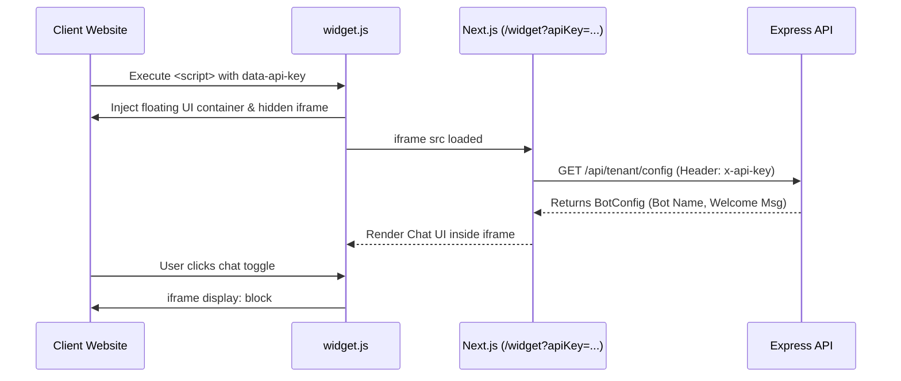

# Operations & Flows

## RAG Pipeline Flow

```mermaid
flowchart TD
    subgraph Ingestion [Document Ingestion]
        Upload[Upload .txt / .md via Admin API] --> Read[Read File Content]
        Read --> Chunk[Split into chunks]
        Chunk --> Embed[Generate Embeddings via OpenAI/HuggingFace]
        Embed --> Store[Store in Pinecone with tenant_id metadata]
    end

    subgraph Retrieval [Chat Retrieval]
        Query[User Query] --> QueryEmbed[Embed Query]
        QueryEmbed --> Search[Similarity Search in Pinecone filtering by tenant_id]
        Search --> Context[Extract text chunks]
        Context --> Prompt[Build Contextual Prompt]
        Prompt --> Grok[Send to Grok API]
    end
```


## Multi-Tenant Enforcement Flow
```mermaid
flowchart TD
    Req[Incoming Request] --> Auth{Auth Middleware}
    
    Auth -->|Admin Dashboard Flow| JWT[Verify JWT token]
    JWT --> ExtractJWT[Extract tenantId from decoded token]
    
    Auth -->|Public Widget Flow| APIKey[Check x-api-key header]
    APIKey --> DBCheck[Lookup Tenant by api_key]
    DBCheck --> ExtractKey[Extract tenantId from Tenant record]
    
    ExtractJWT --> Bind[Attach req.user.tenantId]
    ExtractKey --> Bind
    
    Bind --> Controllers[Controllers / Services]
    
    Controllers --> Prisma[Prisma Database Queries]
    Prisma -->|Always append explicitly| WhereClause[where: { tenant_id: req.user.tenantId }]
    
    WhereClause --> PostgreSQL[(Isolated Tenant Data)]
```

## Widget Integration Flow


## External Integrations Flow
```mermaid
flowchart TD
    subgraph WhatsApp [WhatsApp Handling]
        Twilio[Twilio Webhook] --> |POST /api/webhooks/whatsapp/:tenantId| WA[handleWhatsappWebhook]
        WA --> WAConv[Find/Create Conversation by session_id = Phone Number]
        WAConv --> WARAG[RAG Pipeline + Grok API]
        WARAG --> Twiml[Return TwiML XML Response]
    end

    subgraph Email [Email Handling]
        SendGrid[Email Provider Webhook] --> |POST /api/webhooks/email| Email[handleEmailWebhook]
        Email --> EmailConv[Find/Create Conversation by session_id = Sender Email]
        EmailConv --> Ticket[Create High Priority Ticket]
        Ticket --> Flag[Update Conversation is_human_takeover = true]
    end
```
